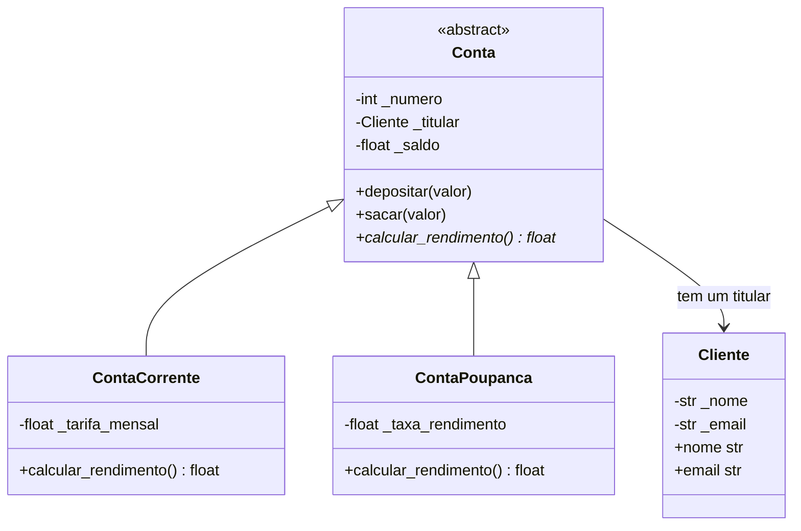

# Sistema bancário orientado a objetos

Exemplo didático em Python de contas bancárias, validação de atributos,
herança, composição e polimorfismo.

## Diagrama de classes



## Decisões de modelagem

- `Conta` é abstrata porque define operações e dados comuns, mas cada tipo de
  conta precisa fornecer sua própria implementação de `calcular_rendimento()`.
- `ContaCorrente` e `ContaPoupanca` **são** contas, portanto a herança expressa
  essa relação e `super().__init__(...)` reutiliza a validação e a inicialização
  da classe base.
- Uma conta **tem** um titular; `Conta` mantém uma instância de `Cliente`, em
  vez de herdar os dados de cliente. Esse vínculo é composição.
- A lista de contas pode conter os dois tipos. A chamada comum
  `calcular_rendimento()` produz resultados distintos: zero na conta corrente e
  saldo multiplicado pela taxa na poupança.

## Validações com `@property`

- O nome do cliente não pode ser vazio; e-mails são verificados e armazenados
  em minúsculas.
- O número da conta precisa ser um inteiro positivo, o titular precisa ser um
  `Cliente` e o saldo deve ser numérico, finito e não negativo.
- Depósitos e saques precisam ser positivos; saques não podem exceder o saldo.
- A tarifa mensal não pode ser negativa e a taxa da poupança deve estar entre
  `0` e `1` (inclusive).
- As validações são aplicadas também na inicialização, pois os construtores
  atribuem os valores pelas propriedades.

## Executar

Requer Python 3.9 ou superior. Execute a demonstração, com dez contas e exemplos
de polimorfismo e tratamento de entradas inválidas:

```bash
python main.py
```

Para executar os testes automatizados:

```bash
python -m unittest -v
```

Exemplo de uso:

```python
from main import Cliente, ContaPoupanca

cliente = Cliente("Maria", "maria@example.com")
conta = ContaPoupanca(123, cliente, saldo=1000, taxa_rendimento=0.01)
print(conta)  # ContaPoupanca nº 123 | Titular: Maria | Saldo: R$ 1000.00 | Rendimento: 1.00%
print(conta.calcular_rendimento())  # 10.0
```

As classes fornecem `__str__` para exibição amigável e `__repr__` para
representação de depuração. Contas também comparam igualdade pelo tipo e número
e ordenam-se pelo saldo.